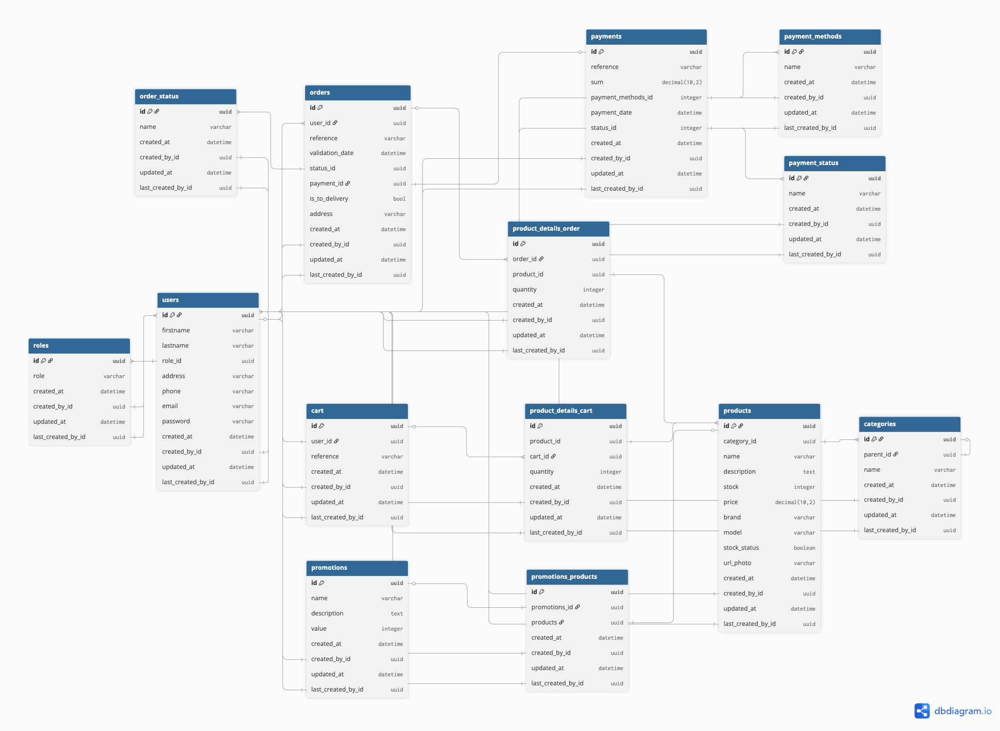

## Description du projet et objectifs
TechZone est une plateforme e-commerce conçue pour répondre aux besoins d'une boutique spécialisée dans les produits high-tech (PC, smartphones, accessoires). L'application gère un catalogue complexe de plusieurs centaines de références, tout en assurant le suivi des commandes et la gestion des stocks pour l'équipe interne.

L'enjeu principal est de fournir une expérience fluide pour les clients, tout en offrant une interface de gestion sécurisée et performante pour les administrateurs.
## Stack technique utilis
| Catégorie   | Outils                | Rôle |
|-------------|-----------------------| --- |
| Langage     | Java 24               | Langage principal |
| Framework   | Spring Boot           | Auto-configuration et gestion des dépendances |
| Persistence | 	Spring Data JPA / H2 | Gestion de la BDD (H2) |
| Sécurité    | Spring Security + JWT | Protection des routes et gestion des rôles ADMIN/USER |
| Frontend    | Thymeleaf             | Moteur de templates pour l'affichage dynamique |
| Build       | Maven                 | Gestion du cycle de vie et du build |

## Architecture du projet 
```
TechZone/
├── Dockerfile
├── docker-compose.yml
├── pom.xml
├── src/main/java/com/techzone/ecommerce/
│   ├── app/
│   │   ├── controller/
│   │   └── handler/
│   ├── config/
│   ├── shared/
│   │   ├── dto/
│   │   ├── entity/
│   │   ├── repository/
│   │   └── service/
│   └── utils/
├── src/main/resources/
│   ├── assets/css/
│   ├── static/images/
│   ├── templates/
│   │   ├── admin/
│   │   ├── cart/
│   │   ├── component/
│   │   ├── error/
│   │   ├── layouts/
│   │   ├── payment/
│   │   ├── product/
│   │   ├── profil/
│   │   ├── register/
│   │   └── security/
│   └── application.properties
└── readme-assets/
```
classDiagram
    Order "1" --> "*" OrderProduct
    User "1" --> "1" Cart

## Instructions de lancement 
Pour le lancement avec docker :<br/>
```docker-compose up --build```

Pour la connexion a la BDD H2 utiliser les settings suivants : <br/>
``` 
database : jdbc:h2:file:/app/data/ecommerce_db
username: sa
password: 
```
## Comptes de test 

### Compte admin: <br/>
&emsp; Adresse email: admin@test.com<br/>
&emsp; Mot de passe: password

### Compte utilisateur:<br/>
&emsp; Adresse email: test@test.com<br/>
&emsp; Mot de passe: password

## Diagramme de classes UML 

```mermaid
erDiagram
    users ||--o{ roles : "has"
    users ||--o{ users : "created_by"
    users ||--o{ categories : "manages"
    users ||--o{ products : "manages"
    users ||--o{ orders : "places"
    users ||--|| cart : "owns"
    
    categories ||--o{ products : "contains"
    
    cart ||--o{ cart_product : "contains"
    products ||--o{ cart_product : "added_to"
    
    orders ||--o{ order_product : "details"
    products ||--o{ order_product : "sold_in"
    
    order_status ||--o{ orders : "defines"

    users {
        long id PK
        varchar firstname
        varchar lastname
        varchar email
    }

    products {
        long id PK
        varchar name
        decimal price
        integer stock
    }

    orders {
        long id PK
        varchar address
        datetime created_at
    }

    order_product {
        long id PK
        integer quantity
        double price
    }

    cart_product {
        long id PK
        integer quantity
    } 
   ```
    

## Schéma de base de données 
https://dbdiagram.io/d/68f24d312e68d21b41ff0652




