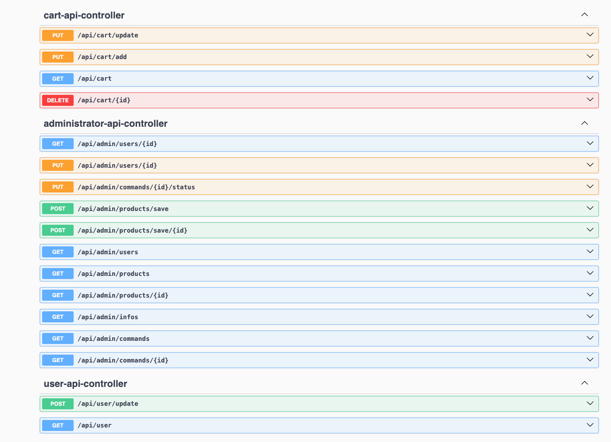
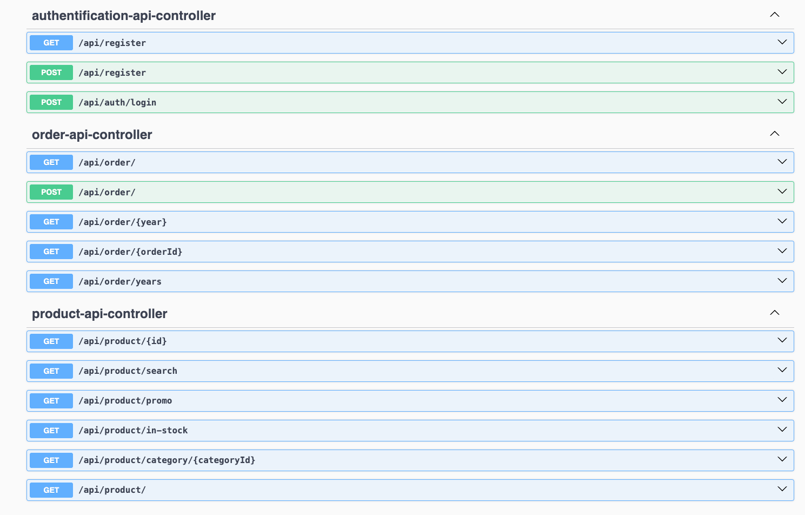

## Description du projet et objectifs
TechZone est une plateforme e-commerce conçue pour répondre aux besoins d'une boutique spécialisée dans les produits high-tech (PC, smartphones, accessoires). L'application gère un catalogue complexe de plusieurs centaines de références, tout en assurant le suivi des commandes et la gestion des stocks pour l'équipe interne.

L'enjeu principal est de fournir une expérience fluide pour les clients, tout en offrant une interface de gestion sécurisée et performante pour les administrateurs.
## Stack technique utilisée
| Catégorie   | Outils                | Rôle |
|-------------|-----------------------| --- |
| Langage     | Java 24               | Langage principal |
| Framework   | Spring Boot           | Auto-configuration et gestion des dépendances |
| persistance | 	Spring Data JPA / H2 | Gestion de la BDD (H2) |
| Sécurité    | Spring Security + JWT | Protection des routes et gestion des rôles ADMIN/USER |
| Frontend    | Thymeleaf             | Moteur de templates pour l'affichage dynamique |
| Build       | Maven                 | Gestion du cycle de vie et du build |

## Architecture du projet 
```
TechZone/
├── Dockerfile
├── docker-compose.yml
├── pom.xml
├── src/main/java/com/techzone/ecommerce/
│   ├── app/
│   │   ├── controller/
│   │   └── handler/
│   ├── config/
│   ├── shared/
│   │   ├── dto/
│   │   ├── entity/
│   │   ├── repository/
│   │   └── service/
│   └── utils/
├── src/main/resources/
│   ├── assets/css/
│   ├── static/images/
│   ├── templates/
│   │   ├── admin/
│   │   ├── cart/
│   │   ├── component/
│   │   ├── error/
│   │   ├── layouts/
│   │   ├── payment/
│   │   ├── product/
│   │   ├── profil/
│   │   ├── register/
│   │   └── security/
│   └── application.properties
└── readme-assets/
```

## Instructions de lancement 
Prérequis :<br/>
Docker et Docker Compose<br/><br/>
Pour le lancement avec docker :<br/>
```docker-compose up --build```

Pour la connexion à la BDD H2, utilisez les paramètres suivants : <br/>
``` 
database : jdbc:h2:file:/app/data/ecommerce_db
username: sa
```
## Comptes de test 

### Compte admin: <br/>
&emsp; Adresse email: admin@test.com<br/>
&emsp; Mot de passe: password

### Compte utilisateur:<br/>
&emsp; Adresse email: test@test.com<br/>
&emsp; Mot de passe: password

## Diagramme de classes UML 

```mermaid
classDiagram
    direction LR
 user "1" --> "1" roles : a un
    user "1" *-- "1" cart : possède
    user "1" <-- "*" order : appartient à
    product "*" --> "1" categorie : possède
    cart "1" *-- "*" cart_product : contient
    product "1" <-- "*" cart_product : référence
    order "1" *-- "*" order_product : contient
    product "1" <-- "*" order_product : référence
    class user {
        -long id
        -LocalDateTime createdAt
        -String createdBy
        -LocalDateTime lastUpdated
        -String lastUpdatedBy;
        -String firstname
        -String lastname
        -RoleEnum role
        -String email
        -String password
        -String address
        -String phone
        -Cart cart
        -List<Order> orders
    }

    class product {
        -long id
        -LocalDateTime createdAt
        -String createdBy
        -LocalDateTime lastUpdated
        -String lastUpdatedBy;
        -Category category
        -String name
        -String description
        -int stock
        -double price
        -String brand
        -String model
        -boolean isAvailable
        -boolean isInStock
        -String urlPhoto
        -byte promotionPourcent
        -boolean isPromotion
    }

    class order {
        -long id
        -LocalDateTime createdAt
        -String createdBy
        -LocalDateTime lastUpdated
        -String lastUpdatedBy;
        -User user
        -OrderStatus status
        -String firstname
        -String lastname
        -String address
        -String phone
        -List<OrderProduct> orderProductList
        -double total
        +double getTotalPrice()
        +int getTotalQty()
    }

    class order_product {
        -long id
        -LocalDateTime createdAt
        -String createdBy
        -LocalDateTime lastUpdated
        -String lastUpdatedBy;
        -Order order
        -Product product
        -int quantity
        -byte promotionPourcent
        -boolean isPromotion
        -double price
        +void calculatePrice()
    }

    class cart {
        -long id
        -LocalDateTime createdAt
        -String createdBy
        -LocalDateTime lastUpdated
        -String lastUpdatedBy;
        -User user
        -List<CartProduct> cartProductList
        -double getTotal()
        -long getQty()
    }

    class cart_product {
        -long id
        -LocalDateTime createdAt
        -String createdBy
        -LocalDateTime lastUpdated
        -String lastUpdatedBy;
        -Cart cart
        -Product product
        -int quantity
    }
   ```
    

## Schéma de base de données 
https://dbdiagram.io/d/68f24d312e68d21b41ff0652


## Endpoint de l'api REST 



https://web.postman.co/workspace/327b9255-72e5-4dfc-9364-e2948faaa2d5/documentation/6be26e24-14d3-4587-9dd2-a93d1a419b2c